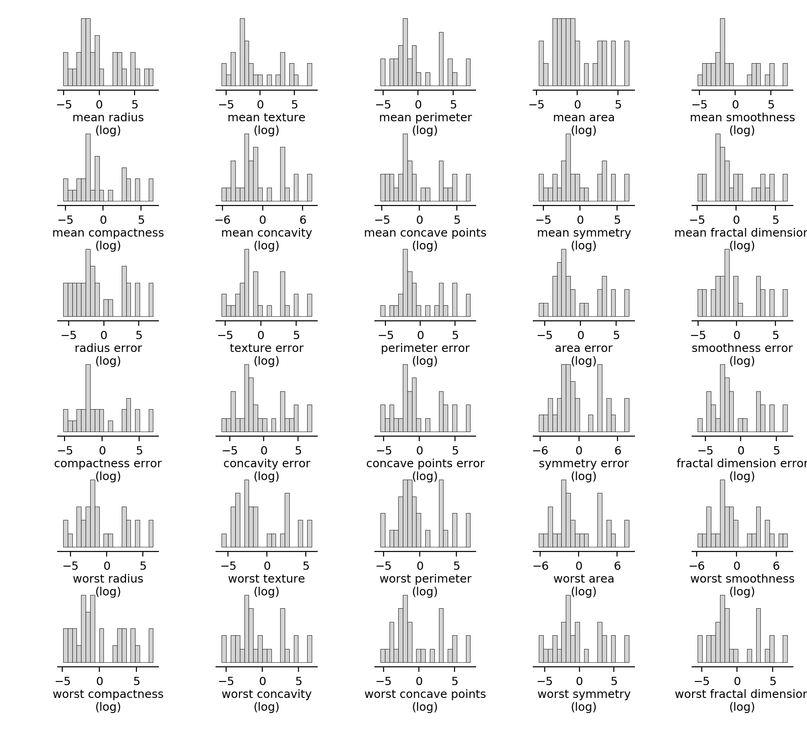

<div></div>

# Graphs

*Get your plots right, all along your analysis workflow. A layer on top of `matplotlib` to achieve flexible & high-standard data visualization across different mediums.*

## Overview: a quick tour of the functionalities

Typically a data science project involves:

### Data mining in Jupyter Notebooks

### Analysis automation (on full dataset) using scripts

### Exports to carefully-designed multi-panel figures for final reports


## Installation

Using =git= to clone the repository and "pip" to install the package in your python environment:

```
git clone https://github.com/yzerlaut/graphs.git
pip install -r requirements.txt
pip install graphs/
```


## Use

After installation, import the module and create a specific graph environment with:

```
from graphs import graph_env
ge = graph_env('manuscript') # for a figure export to A4 manuscript size
```

```
sge = graph_env('screen') # env to scale the figure display on screen monitor
sge.hist(np.random.randn(100))
sge.show()
```

## Settings

You can specifiy different environments corresponding to different visualization settings. 
```
ENVIRONMENTS = {
    'manuscript': {
	'fontsize':10,
    },
    'dark_notebook': {
    }
}
```

## Features

We document here the different plotting features covered by the library:

### Pie plots


```
# building data
data = .5+np.random.randn(3)*.4

#plotting
fig, ax = mg.pie(data,
				 ext_labels = ['Data1', 'Data2', 'Data3'],
				 pie_labels = ['%.1f%%' % (100*d/data.sum()) for d in data],
				 ext_labels_distance=1.2,
				 explodes=0.05*np.ones(len(data)),
				 center_circle=0.2,
				 COLORS = [mg.tab20(x) for x in np.linspace(0,1,len(data))],
				 # pie_args=dict(rotate=90), # e.g. for rotation
				 legend=None) 
				 # set legend={} to have it appearing
fig.savefig('./docs/pie-plot.png', dpi=200)
```
Output:


### Features plot

```
mg = .)

# data: breast cancer dataset from sklearn
from sklearn.datasets import load_breast_cancer
raw = load_breast_cancer()

# re-arange for plotting
data = {}
for feature, values in zip(raw['feature_names'], raw['data']):
	data[feature+'\n(log)'] = np.log(values)

# plotting
fig, AX = mg.features_plot(data, ms=3,
						   fig_args={'left':.1, 'right':.3, 'bottom':.1, 'top':.1,
									 'hspace':.4, 'wspace':.4})
fig.savefig('docs/features-plot.png', dpi=200)
```


### Cross-correlation plot

Look at the cross-correlation between several joint measurements and estimate the signficance of the correlation:
```
# building random data
data = {}
for i in range(7):
	data['feature_%s'%(i+1)] = np.random.randn(30)

# plotting
fig = mg.cross_correl_plot(data,
						   features=list(data.keys())[:7])

fig.savefig('./docs/cross-correl-plot.png', dpi=200)
```
Output:


### Bar plots

#### Classical bar plot

```
mg.bar(np.random.randn(5), yerr=.3*np.random.randn(5), bottom=-3, COLORS=mg.colors[:5])
```

#### Related sample measurements
```
fig, ax, pval = mg.related_samples_two_conditions_comparison(np.random.randn(10)+2., np.random.randn(10)+2.,
															 xticks_labels=['$\||$cc($V_m$,$V_{ext}$)$\||$', '$cc(V_m,pLFP)$'],
															 xticks_rotation=45, fig_args={'bottom':1.5, 'right':8.})
fig.savefig('docs/related-samples.png', dpi=200)
```


#### Unrelated sample measurements
```
fig, ax, pval = mg.unrelated_samples_two_conditions_comparison(np.random.randn(10)+2., np.random.randn(10)+2.,
															   xticks_labels=['$\||$cc($V_m$,$V_{ext}$)$\||$', '$cc(V_m,pLFP)$'],
															   xticks_rotation=45, fig_args={'bottom':1.5, 'right':8.})
fig.savefig('docs/unrelated-samples.png', dpi=200)
```


### Line plots


### Scatter plots
### Surface plots
