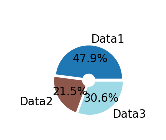

# Graphs

*Get your plots right, all along your analysis workflow. A layer on top of `matplotlib` to achieve flexible & high-standard data visualization across different mediums.*

Typically a data science project involves:

### Data mining in Jupyter Notebooks

### Analysis automation (on full dataset) using scripts

### Exports to carefully-designed multi-panel figures for final reports

## Installation

Using git:

`git clone https://github.com/yzerlaut/graphs.git`


## Use: pre-program the output on your different medium

```
ENVIRONMENTS = {
    'manuscript': {
	'fontsize':10,
    },
    'dark_notebook': {
    }
}
```

## Features

We document here the different plotting features covered by the library:

### Pie plots

mg = graphs('screen')

```
# building data
data = .5+np.random.randn(3)*.4

#plotting
fig, ax = mg.pie(data,
				 ext_labels = ['Data1', 'Data2', 'Data3'],
				 pie_labels = ['%.1f%%' % (100*d/data.sum()) for d in data],
				 ext_labels_distance=1.2,
				 explodes=0.05*np.ones(len(data)),
				 center_circle=0.2,
				 COLORS = [mg.tab20(x) for x in np.linspace(0,1,len(data))],
				 # pie_args=dict(rotate=90), # e.g. for rotation
				 legend=None) 
				 # set legend={} to have it appearing
fig.savefig('./docs/pie-plot.png', dpi=200)
```
Output:



### Cross-correlation plot

Look at the cross-correlation between several joint measurements and estimate the correlation of 
```
# building random data
data = {}
for i in range(7):
	data['feature_%s'%(i+1)] = np.random.randn(30)

# plotting
fig = mg.cross_correl_plot(data,
						   features=list(data.keys())[:7])

fig.savefig('./docs/cross-correl-plot.png', dpi=200)
```
Output:

